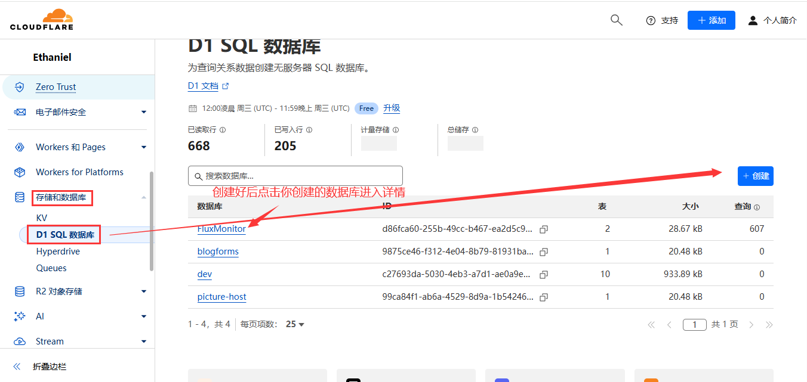
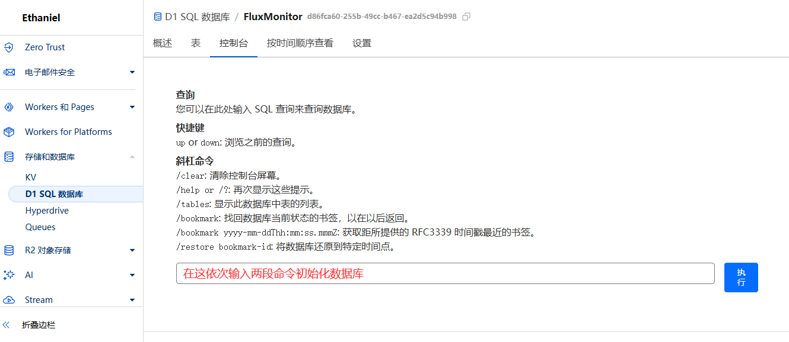
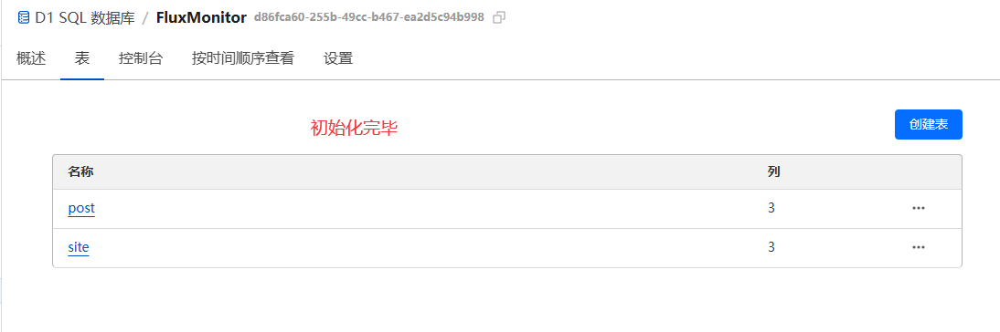
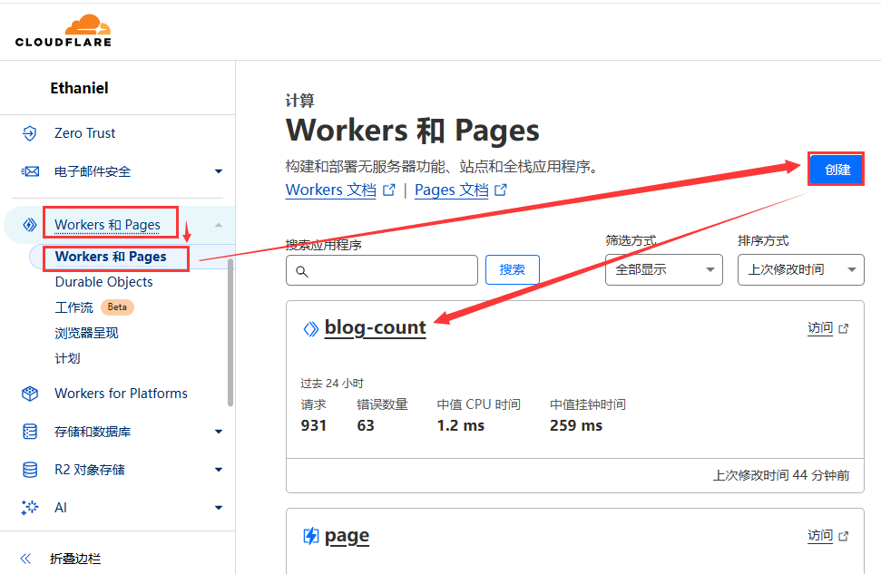
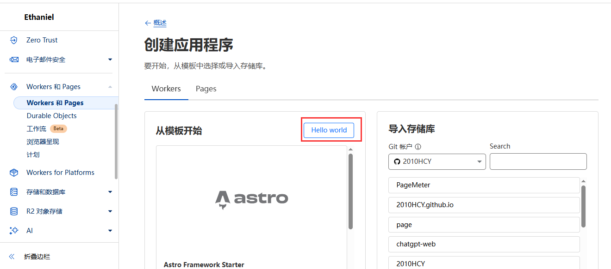
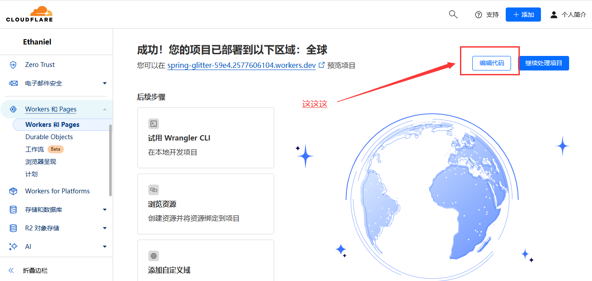
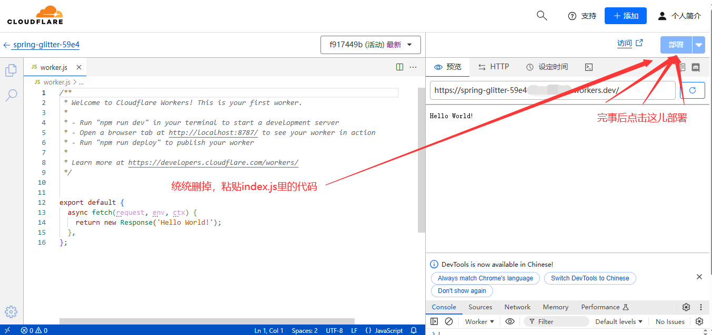
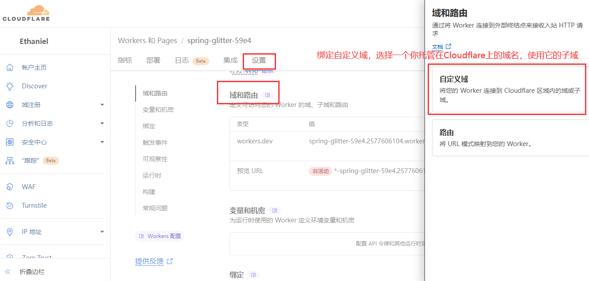

# PageMeter

一个使用CloudflareWorkers做后端，D1做数据库的网站访问次数记录器，类似不算子

查看在线演示：[PageMeter计数器示例](https://page.100713.xyz/示例)

为什么要做这个项目？因为不算子实在是太不稳定了，基本不可能加载出数据，统计功能也是可有可无。但如果使用大大善人Cloudflare搭建，不仅能够稳定，数据也完全掌握在自己的手中，[我的博客](https://100713.xyz)现在使用的就是PageMeter。

下面开始部署教程：

## 1.后端部署：

[](https://deploy.workers.cloudflare.com/?url=https://github.com/2010HCY/PageMeter)

1. 注册或登录Cloudflare（废话）

2. 创建一个D1数据库，名称随意，但要记住后面要用，这里我的名称叫PageMeter

   

3. 进入数据库详情，找到控制台，在控制台中依次输入以下命令初始化数据库：

   ```
   CREATE TABLE post (
     url TEXT PRIMARY KEY,
     visit_count INTEGER DEFAULT 0,
     visitor_count INTEGER DEFAULT 0
   );
   ```

   ```
   CREATE TABLE site (
     domain TEXT PRIMARY KEY,
     visit_count INTEGER DEFAULT 0,
     visitor_count INTEGER DEFAULT 0
   );
   ```

   

   然后打开表，如果你看到了如下信息就说明成功了

   | 名称                                                         | 列   |
   | :----------------------------------------------------------- | :--- |
   | [post](https://dash.cloudflare.com/57e18b4fb317b217ebf8b0f74415ab9e/workers/d1/databases/d86fca60-255b-49cc-b467-ea2d5c94b998/tables/post) | 3    |
   | [site](https://dash.cloudflare.com/57e18b4fb317b217ebf8b0f74415ab9e/workers/d1/databases/d86fca60-255b-49cc-b467-ea2d5c94b998/tables/site) | 3    |

   

4. 打开Workers和Pages，创建一个Workers，选HelloWorld

   

   

5. 创建好后点击编辑代码，把原来的代码统统删掉，然后把 [这里的代码](/src/index.js) 复制粘贴进去，然后点击右上角部署

   

   

6. 由于CloudflareWorkers自带的域名在中国大陆被墙，基本不可能使用，所以我们还要添加自定义域，转到设置→域和路由→自定义域，输入一个域名，需要托管在Cloudflare上

   

7. 完成！你可以输入你的自定义域，出现“部署成功”的字样就说明你部署好了后端

## 2.前端应用

1. 先下载[blog-count.js](https://github.com/2010HCY/PageMeter/releases/download/1.0.1/blog-count.js)文件

2. 打开下载好的blog-count.js，把里面第六行中的

   ```
   const baseUrl = `https://<你的域名>/visitor-count?target=${encodeURIComponent(target)}`;
   ```

   <你的域名>换成你前面后端部署的域名

3. 打开你要插入访问量统计显示的页面，引入JS文件`<script async src="/blog-count.js"></script>`注意你要把src=""字段替换成你实际存放blog-count.js的路径

4. 然后在你希望显示访问量的地方安装标签：

   ```
       本站总阅读量<span id="PageMeter_site_pv"></span>次
   ```

完成！JS脚本会自动替换`<span id="PageMeter_site_pv"></span>`字段将其替换成实际访问数据，PageMeter支持的标签有以下四种：

统计站点pv

```
本站总阅读量<span id="PageMeter_site_pv"></span>
```

统计站点uv

```
本站访客数<span id="PageMeter_site_uv"></span>
```

统计页面pv

```
本文总阅读量<span id="PageMeter_page_pv"></span>
```

统计页面uv

    本文总访客数<span id="PageMeter_page_uv"></span>

> uv是访客数，pv是阅读数
